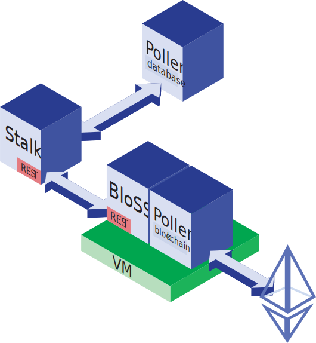

# The Blockchain Signaling System

Enabling cooperative, multi-domain DDoS defense by distributing attack reports through Ethereum among participating autonomous systems.

The entire system consists of three main components:

**Stalk** monitors the network traffic of the underlying networking infrastructure

**Pollen** encapsulates all communication-related tasks, handling the database and Ethereum

**BloSS** is the core component which receives mitigation requests and signals ongoing attacks through *Pollen* and stops attack traffic through *Stalk*

       
## Installation
### Python Prerequisites
The entire BloSS is written in Python 2.7, so you need to have a working Python installation as well as the required packages, which can be found in `python_requirements.txt` and can be installed through pip (you can get pip for example through `apt-get install python-pip`):

>`pip install -r python_requirements.txt`

### Configuration File
Create your custom `config.ini` file by looking at the `default_config.ini` template.

### System Components
You need a working instance of **InfluxDB** for statistical data to be stored and an **Ethereum blockchain** for the mitigation to work.

---

The current implementation does not yet support deploying the required contracts. This means, you first need to deploy the `relay.sol` contract, followed by the `autonomous_system.sol` contracts for each autonomous system. Make sure to deploy the system contracts through the ethereum node running on the same system as the BloSS controller. This ensures, that the owner of the contract will be the correct ethereum node. Finally, register all subdomains with the relay contract through the `addSubnetwork()` method. Through the Remix IDE, you can use the following parameters for the method:

>"192.168.1.0/24","0xDEADBEEFFEED"

which would for example register the 192.168.1.0 subnet with netmask 255.255.255.0 to be managed by the system contract with address 0xDEADBEEFFEED.

*This very tedious setup process should be automated in a future revision of the BloSS system.*

---

### Starting BloSS

After setting up all relevant components, you can directly start the entire system by issuing:

>`$ python runner.py --controller stalk/simple_router.py --controller stalk/controller.py`

Which starts both a simple packet-forwarding Ryu manager called SimpleRouter as well as the Stalk controller monitoring the network traffic.
